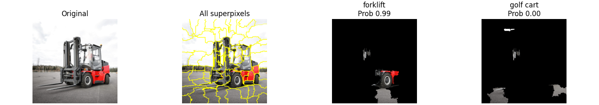

# 🍋 Custom LIME Implementation for Computer Vision

[]()
[]()
[]()

A robust, from-scratch implementation of the **LIME (Local Interpretable Model-agnostic Explanations)** algorithm for explaining black-box Computer Vision models.

This implementation allows users to visualize which parts of an image a Deep Learning model (like InceptionV3) focuses on when making a prediction.

 

## 🚀 Features
* **Modular Design:** Clean separation between the Explainer logic and Visualization.
* **Model Agnostic:** Can be easily adapted for any PyTorch CNN.
* **Interpretable Visualization:** Highlights top superpixels contributing to the prediction.
* **Weighted Linear Regression:** Implements the core mathematical concept of LIME using weighted cosine similarity.

## 🛠️ Installation

1.  Clone the repository:
    ```bash
    git clone [https://github.com/Samarth-KY/LIME-Implementation.git](https://github.com/Samarth-KY/LIME-Implementation.git)
    cd LIME-Implementation
    ```

2.  Install dependencies:
    ```bash
    pip install -r requirements.txt
    ```

## 💻 Usage

### Quick Start (Python)
You can run the explainer directly on any image URL:

```python
from lime_explainer import LimeExplainer
from torchvision import models

# 1. Load your pre-trained model here
model = models.inception_v3(weights='DEFAULT')

# 2. Initialize LIME explainer
explainer = LimeExplainer(model)

# 3. Load an image and explain it
# top_k specifies how many of the model’s top predicted classes to explain (e.g., top_k=2 explains the top-2 predictions)
img = explainer.load_image_from_url('[https://example.com/my_image.jpg](https://example.com/my_image.jpg)')
results = explainer.explain(img, top_k=2)

# 4. Visualize
explainer.visualize(img, results)
